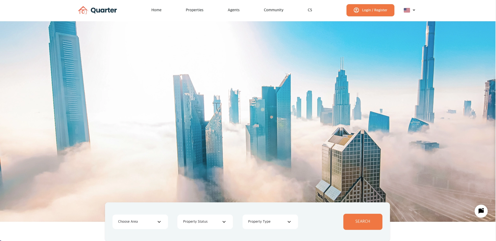
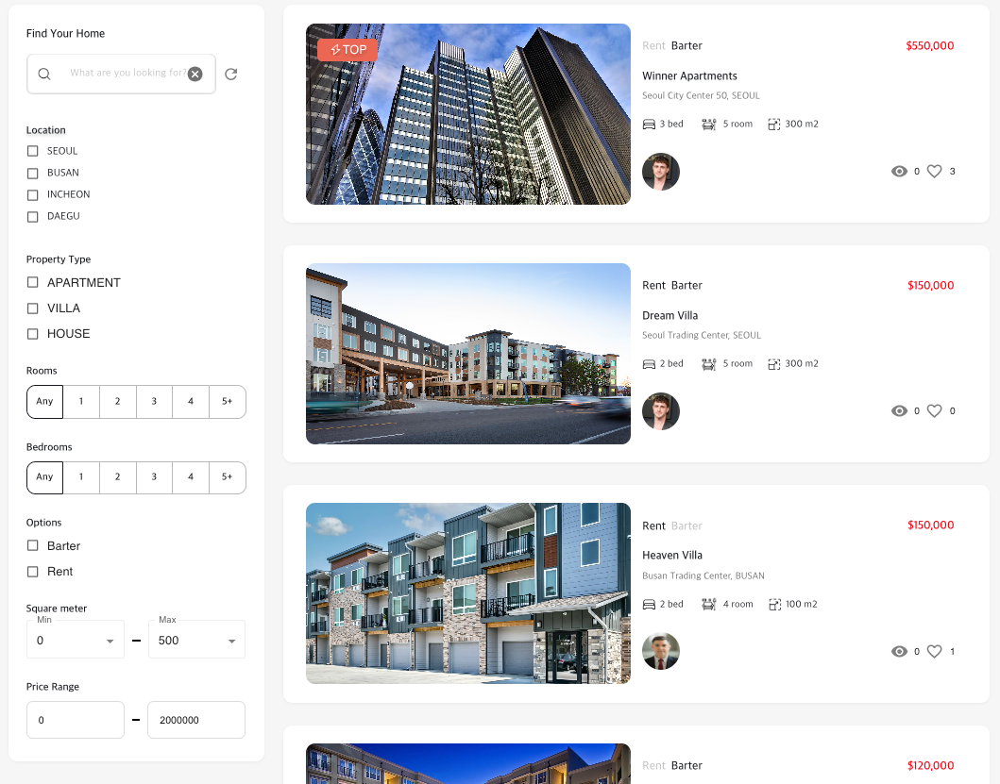
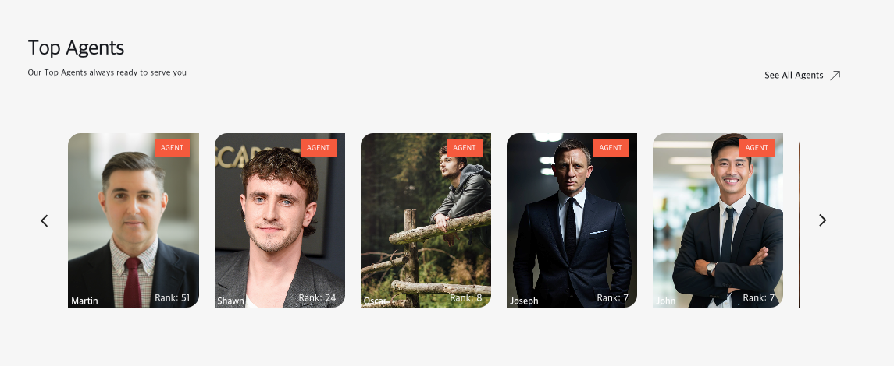
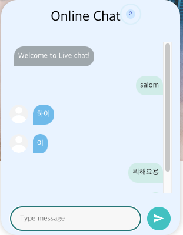
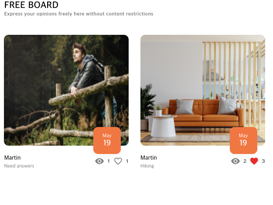
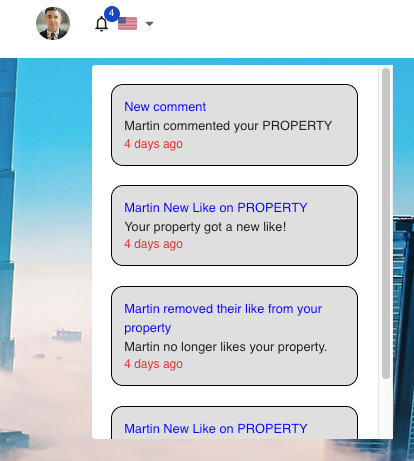
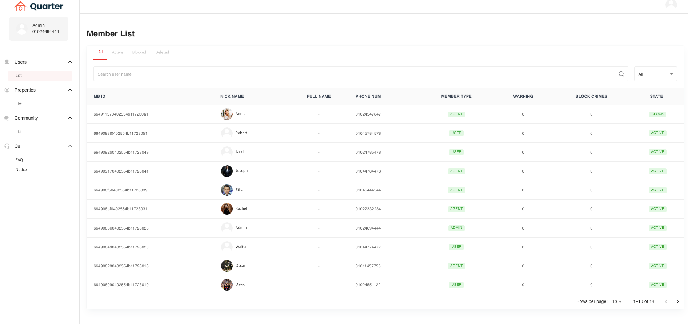

## 웹 애플리케이션 소개

*메인 홈 화면: 직관적인 UI와 검색 편의성을 강조한 접근성 높은 랜딩 페이지 화면입니다.*

*매물 검색 및 리스트 화면: 우측에는 요약 정보 카드, 좌측에는 지역, 면적, 가격 등 다중 조건 필터링을 제공하여 원하는 매물을 손쉽게 조회할 수 있습니다.*

*중개인(Agent) 리스트 화면: 플랫폼 내 공인중개사(Agent)들을 조회하며, 이름 검색 및 정렬(최신순, 인기순, 조회순) 기능을 통해 적합한 담당자를 탐색할 수 있는 화면입니다.*

*실시간 온라인 채팅(Live Chat): WebSocket(Socket.io) 기반의 실시간 통신을 적용하여, 앱 내에서 다른 사용자와 즉각적으로 소통할 수 있는 플로팅 채팅 위젯입니다.*

*커뮤니티 게시판(Community Board): 사용자 간 자유롭게 정보를 공유하는 커뮤니티 화면입니다. Free, Recommend, News, Humor 등의 탭(Tab) 카테고리를 지원하며, 게시글 목록, 좋아요(Like), 조회수 관리 기능이 모두 구현되어 있습니다.*

*퍼스널 알림(Notifications): 좋아요(Like) 생성/취소, 신규 댓글 등 사용자의 매물과 게시글에 발생한 이벤트 내역을 모아보는 알림 드롭다운 창입니다.*

*관리자 페이지(Admin Dashboard): 전체 유저(User/Agent) 상태, 매물 및 커뮤니티 데이터, 고객센터(FAQ/Notice)를 통합적으로 조회하고 제어할 수 있는 어드민 통합 관리 패널입니다.*
**Quarter-next**는 사용자 친화적인 UI와 반응형 웹 디자인을 적용한 종합 부동산/커뮤니티 플랫폼의 프론트엔드 웹 애플리케이션입니다.
GraphQL을 통한 백엔드 서버와의 매끄러운 통신을 바탕으로 매물(Property) 정보 검색, 커뮤니티 상호작용, 사용자 관리 등을 제공합니다.

---

## 🛠 기술 스택 (Tech Stack)
- **Framework:** Next.js (React)
- **Language:** TypeScript
- **State Management & Data Fetching:** Apollo Client (GraphQL)
- **UI Library & Styling:** Material-UI (MUI v5), SCSS (Sass), Styled-Components
- **Internationalization (국제화):** next-i18next
- **3D & Animation (선택적 사용):** Three.js (react-three-fiber), Valtio, Framer Motion (react-spring)
- **기타 라이브러리:** SweetAlert2 (알럿창), Swiper (캐러셀)

---

##  주요 기능 및 구현 사항 (Key Features)

### 1. GraphQL/Apollo 기반 데이터 패칭 (Data Fetching)
- Apollo Client를 활용하여 메인 백엔드(NestJS)의 GraphQL API와 효율적으로 통신
- 페이지 내 필요 항목만 선별적으로 요청하는 GraphQL의 특성을 활용해 컴포넌트 렌더링 성능 최적화
- `_app.tsx`에 `ApolloProvider` 글로벌 설정 적용 및 로컬 스토리지 정보/토큰을 활용한 인증(Authentication) 연동

### 2. 컴포넌트 기반 UI 설계 (MUI & SCSS)
- **Material-UI (MUI)**의 `ThemeProvider`를 사용해 일관적인 라이트/다크 테마 환경 구성 및 전역 스타일(`CssBaseline`) 제어
- 페이지 및 모듈별 커스텀 스타일링을 위해 SCSS를 병행 사용 (`scss/pc`, `scss/mobile` 분리 등 반응형(Responsive) 환경 고려)
- 다채로운 상호작용 및 알림창을 처리하기 위해 SweetAlert2 커스텀 활용

### 3. 직관적인 페이지 라우팅 구조 (Page Routing)
기능별 페이지 폴더 트리를 통해 유지보수가 용이한 모듈화 구조 채택:
- `/property` : 매물 등록/조회 및 상세 뷰 페이지
- `/community` : 게시글 목록 및 작성 기능
- `/member` / `/account` / `/agent` : 권한별 유저 마이페이지 접속 및 로그인/회원가입
- `/cs` : 자주 묻는 질문(FAQ) 및 고객 문의

### 4. 국제화 및 로컬라이제이션 설정 (i18n)
- `next-i18next`를 사용해 다국어 지원 환경을 구축함으로써 글로벌 서비스 확장 가능성 확보

---

